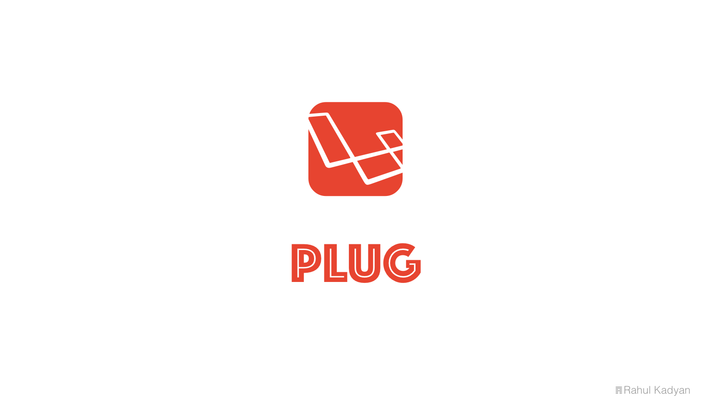

Plug
====
A collection of pluggable [Eloquent](https://laravel.com/docs/master/eloquent) traits to enhance your Models.



<p align="center">
  <a href="https://styleci.io/repos/50701599">
    
  </a>
  <a href="https://circleci.com/gh/znck/plug">
    
  </a>
  <a href="https://coveralls.io/github/znck/plug?branch=master">
    
  </a>
  <a href="LICENSE">
    
  </a>
  <a href="https://packagist.org/packages/znck/plug">
    
  </a>
  <a href="https://github.com/znck/plug/releases">
    
  </a>

  <a href="https://github.com/znck/plug/issues">
    
  </a>
</p>

## Installation

Either [PHP](https://php.net) 7.0+ is required.

To get the latest version of Plug, simply require the project using [Composer](https://getcomposer.org):

```bash
$ composer require znck/plug
```

Instead, you may of course manually update your require block and run `composer update` if you so choose:

```json
{
    "require": {
        "znck/plug": "^0.1"
    }
}
```

Once Plug is installed, you can use the plug[gable] traits.

## Usage
All features of Plug are provided as traits, so you can directly put them in you model class. Traits would automatically boot. No configuration is required.  
```php
<?php namespace App;

use Illuminate\Database\Eloquent\Model;
use Znck\Plug\Eloquent\Traits\BelongsToThrough;

class User extends Model {
  use BelongsToThrough;
}
```

Best practice is to create an abstract model class and use required plugs(traits).  
```php
<?php namespace App;

use Illuminate\Database\Eloquent\Model;
use Znck\Plug\Eloquent\Traits\BelongsToThrough;
use Znck\Plug\Eloquent\Traits\FixBelongsTo;
use Znck\Plug\Eloquent\Traits\FixMorphTo;
use Znck\Plug\Eloquent\Traits\UuidKey;
use Znck\Plug\Eloquent\Traits\FixForeignKey;
use Znck\Plug\Eloquent\Traits\SelfDecorating;
use Znck\Plug\Eloquent\Traits\SelfValidating;

abstract class UUIDBaseModel extends Model
{
    use FixBelongsTo, FixMorphTo, BelongsToThrough, UuidKey, SelfValidating, SelfDecorating, FixForeignKey;

    public $incrementing = true; // Explained below.
}

```

## Traits

1. **BelongsToThrough**  
Inverse of HasManyThrough relation is missing from Eloquent. This plug (trait) provides `belongsToThrough` relationship. Under the hood, it uses `BelongsToThrough` from [znck/belongs-to-through] package.

1. **FixBelongsTo**  
To maintain expected behavior of `belongsTo` relation, Eloquent has introduced a bug.
If model has non-incrementing primary key (ex: UUID) and `belongsTo` relation value is null, then if it is eager loaded, it would die due to SQL error. [Issue 12051](https://github.com/laravel/framework/issues/12051)

1. **FixForeignKey**  
Eloquent has misleading behavior when guessing foreign key field name. It takes lowercase singular name of model class and appends `_id` to it, which is very counter-intuitive. Expected behavior is that it should guess foreign key field name from table name. [Issue 10724](https://github.com/laravel/framework/issues/10724)

1. **FixMorphTo**  
Relation class `MorphTo` inherits `BelongsTo`, so it is prone to same bug.

1. **SelfDecorating**  
It keeps database entries clean. For example: values in `name` column should start with uppercase letter.
> Add detailed documentation.

1. **SelfValidating**  
It validates attributes before saving or updating, hence only valid data goes in database.
> Add detailed documentation.

1. **UuidKey**  
It allows to usage of non-incrementing UUID primary keys.
  ```php
  class User extends Model {
    use UuidKey;
    // Make sure to set $incrementing to false.
    public $incrementing = false;
  }
  ```

## Change log

Please see [CHANGELOG](CHANGELOG.md) for more information what has changed recently.

## Testing

``` bash
$ composer test
```

## Contributing

Please see [CONTRIBUTING](CONTRIBUTING.md) and [CONDUCT](CONDUCT.md) for details.

## Security

If you discover any security related issues, please email :author_email instead of using the issue tracker.

## Credits

- [Rahul Kadyan][link-author]
- [All Contributors][link-contributors]

## License

The MIT License (MIT). Please see [License File](LICENSE) for more information.

[link-author]: https://github.com/znck
[link-contributors]: ../../contributors
